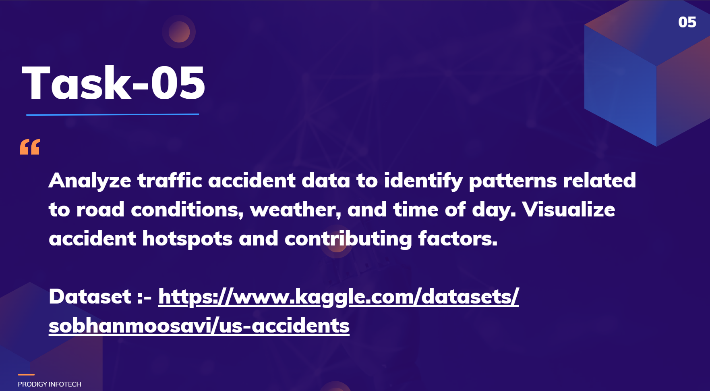

# Prodigy InfoTech Data Science Internship Task 5

   
  

Welcome to my submission for **Task 5** of the Data Science Internship at **Prodigy Infotech**.
In this task, I analyzed **traffic accident data** to identify patterns related to **road conditions, weather, and time of day**, and visualized **accident hotspots and contributing factors**.

---

## 📌 Problem Statement

Traffic accidents are influenced by multiple factors such as **weather conditions, road surface, lighting, and driver behavior**. Identifying these patterns can help in **improving road safety measures, traffic management, and accident prevention strategies**.

The objective of this task is to analyze a large traffic accident dataset and:

* Discover patterns in accidents with respect to **time, weather, and road conditions**
* Visualize **accident-prone areas (hotspots)**
* Highlight the **major contributing factors** to accidents

---

## 📊 Dataset

The dataset used is the **US Accidents Dataset**, available on Kaggle.

👉 [Dataset Link](https://www.kaggle.com/datasets/sobhanmoosavi/us-accidents)

### Features (selected):

* **Start\_Time, End\_Time** → Time of accident occurrence
* **Start\_Lat, Start\_Lng** → Location coordinates
* **Weather\_Condition** → Weather at the time of accident
* **Temperature, Visibility, Wind\_Speed** → Environmental conditions
* **Severity** → Accident severity (1–4)
* **State, City, County** → Accident location
* **Amenity, Crossing, Junction, Traffic\_Signal** → Road conditions

---

## 🛠 Tools and Libraries Used

The project was carried out in **Python** using **Jupyter Notebook**. The following libraries were used:

* **Pandas & NumPy** → Data preprocessing and manipulation
* **Matplotlib & Seaborn** → Data visualization and plots
* **Folium & Plotly** → Interactive map visualizations of accident hotspots
* **Datetime** → Time-based accident trend analysis

---

## 🔎 Approach

1. **Data Preprocessing**

   * Cleaned missing values
   * Converted date and time fields to `datetime` format
   * Filtered relevant attributes for analysis

2. **Exploratory Data Analysis (EDA)**

   * Distribution of accidents by **time of day, day of week, and month**
   * Weather-related accident patterns
   * Severity distribution across states and cities

3. **Geospatial Analysis**

   * Used **latitude & longitude** to plot accident hotspots on maps
   * Identified high-risk cities and highways

4. **Visualization**

   * Heatmaps of accident density
   * Bar/Pie charts of contributing factors
   * State-wise accident severity distribution

---

## 📈 Results

* **Time Factor:** Most accidents occurred during **peak traffic hours (7–9 AM, 4–7 PM)**
* **Weather Factor:** Clear weather still accounted for most accidents, but severe weather (rain, snow, fog) increased accident severity
* **Location Factor:** States like **California, Florida, and Texas** had the highest accident counts
* **Hotspots:** Urban areas showed higher accident density compared to rural roads

---

## ✅ Conclusion

This task highlights how **traffic accident analysis** can uncover crucial safety insights.
By studying accident patterns:

* Governments can **improve road safety measures**
* Cities can identify **accident-prone zones (hotspots)**
* Policymakers can design **preventive strategies** for high-risk conditions

---

👩‍💻 **Developed by:** Akshatha Hosamani
📅 Internship: Prodigy InfoTech – Data Science

